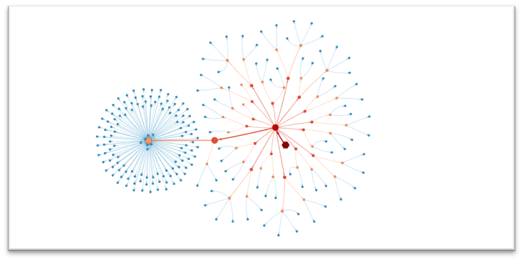
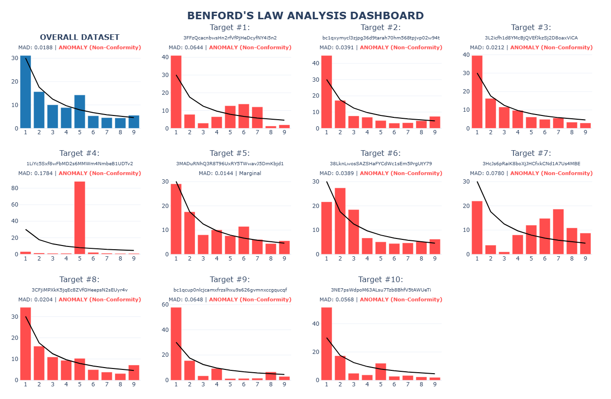

```markdown
# Bitcoin Forensic Transaction Analysis – Code & Data Availability

This repository accompanies the journal article
*“[High Performance Rust-Python Blockchain Forensics for Money Laundering Anomaly Detection]”* 
and provides the complete source code, data extraction procedures, and visualisation scripts
required to reproduce the forensic analysis of large‑scale Bitcoin money‑laundering
operations. The pipeline leverages a high‑performance Rust engine for address
clustering, Benford’s Law anomaly detection, Sybil identification, and depth‑first
graph traversal, all exposed to Python via PyO3.

**Case Study**: The PlusToken scam (2019) – over 2 million BTC moved through
layered transactions. The tools provided here were used to detect syndicate
clusters, trace fund escape routes, and flag statistical anomalies in the
on‑chain data.

## Repository Structure

```text
.
├── .github/                         # GitHub Actions workflows and configuration
├── .idea/                           # IntelliJ/JetBrains IDE workspace configuration
├── .venv/                           # Python virtual environment
├── .vscode/                         # VS Code workspace configuration
├── image                            # Example Image Directory
├── python_presentation/             # Directory for Python-based analysis and presentation
│   ├── lib/                         # Supporting Python modules or libraries
│   └── main.ipynb                   # Main Jupyter Notebook for visualization and analysis
├── src/                             # Rust source code directory
│   ├── heist_catcher.code-workspace # VS Code multi-root workspace configuration
│   └── lib.rs                       # Rust forensic engine (PyO3 module)
├── .gitignore                       # Specifies intentionally untracked files to ignore
├── BigQuerySQL.md                   # SQL queries and documentation for BigQuery data extraction
├── Cargo.lock                       # Rust dependency lockfile
├── Cargo.toml                       # Rust project manifest and dependencies
├── pyproject.toml                   # Python project metadata and dependencies
├── README.md                        # Main project documentation
└── uv.lock                          # Python dependency lockfile (managed by uv)
```

## Requirements

- **Rust** (stable 1.70+) with standard `cargo` and `maturin` for Python
  bindings.
- **Python 3.8+** with the following packages:
  - `UV` (for python package manager)
  - `maturin` (for building the Rust extension)
  - `pandas`, `numpy`, `plotly`, `pyvis`, `psutil`, `scipy` (optional)
- **Google Cloud account** with BigQuery access (if you need to re‑extract
  data).


This will produce a module named `skripsi_forensik` that can be imported in
Python.

## Data Extraction (BigQuery)

The analysis targets the public Bitcoin dataset on Google BigQuery:
`bigquery-public-data.crypto_bitcoin.transactions`. Use the provided
`bigquery_extract.sql` query to export the transaction slice of interest.

1. Open the [BigQuery Console](https://console.cloud.google.com/bigquery) and
   select your project.
2. Run the query in `bigquery_extract.sql`. Modify the date range as needed.
3. Export the results as CSV files (one or multiple) to a local folder.

The Rust engine expects a folder path containing `.csv` files. Each CSV row
must follow the schema: `tx_id`, `timestamp`, `vin` (JSON string array),
`vout` (JSON string array of objects with `address` and `value_satoshi`).

## Usage (Reproduction Steps)

The entire analysis is designed to be run interactively inside a Jupyter
notebook. Simply open a new notebook, copy the code from each part (identical
to the standalone scripts) into a cell, and execute the cells in order.  
Make sure the Rust extension has been built (`maturin develop --release`) and
that the folder path in Part 1 points to your CSV files.

---

### Part 1 – Data Loading & Benchmark

Loads the transaction CSVs, builds the address clusters and the transaction
graph, and reports performance metrics.

*Corresponds to `step1_load_benchmark.py`.*

---

### Part 2 – Sybil Clustering

Uses Union‑Find to identify address clusters with at least 500 wallets and
displays the ten largest entities.

*Corresponds to `step2_sybil_clustering.py`.*

---

### Part 3 – DFS Tracing

Traces fund escape routes from the second‑largest Sybil cluster using a
depth‑first search, recording up to 200 000 paths.

*Corresponds to `step3_dfs_tracing.py`.*

---

### Part 4 – Network Visualization

Creates an interactive HTML graph (`heatmap_plustoken_pyo3.html`) that maps
the escape routes with colour‑coded hops, cycle detection, and volume
estimation.

*Corresponds to `step4_network_viz.py`.*



---

### Part 5 – Benford’s Law Dashboard

Computes the Mean Absolute Deviation (MAD) for the overall dataset and each
of the top‑10 clusters, then renders a 3×4 Plotly dashboard comparing
observed digit frequencies to the theoretical Benford distribution.

*Corresponds to `step5_benford_analysis.py`.*


---

All intermediate variables (e.g., `sorted_clusters`, `escape_routes`,
`benford_data`) remain in memory as the notebook progresses, so the entire
workflow can be reproduced from data loading to final visualisations in a
single session.

## Outputs

- **Console logs**: performance metrics, MAD test results.
- **HTML visualisations**: interactive transaction graphs and Benford analysis
  dashboards.
- **The same data used in the journal figures** can be derived from the
  structures `sorted_clusters`, `escape_routes`, and `benford_data` printed by
  the scripts.

## License & Citation

This repository is released under the [MIT License].

For questions, please open an issue on the repository.
```